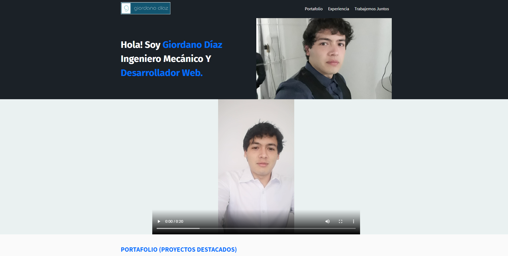

#  🧐 My CV Web

> This is a solo project creating a CV web, as part of the program of PLATZI in the courses of HTML and CSS3.

## 🔧 Built With

- HTML and CSS3.
- Using UX.

## 🔴 Live Demo

[Live Demo Link](https://diazgio.github.io/My_Cv_web/)

## 🛠 Getting Started

To get a local copy up and running follow these simple example steps.

- Go to the main page of te repo.
- Press the "Code" button and get the repo link.
- Clone it using git.

## ✒️ Authors

👤 **Giordano Díaz**

- Github: [@diazgio](https://github.com/diazgio)
- Twitter: [@giordano_diaz](https://twitter.com/giordano_diaz)
- LinkenIn:[LinkenIn](www.linkedin.com/in/Giordano-Diaz)

## 🤝 Contributing

Contributions, issues and feature requests are welcome!

Feel free to check the [issues page](issues/).

## 📝 License

This project is [MIT](lic.url) licensed.
